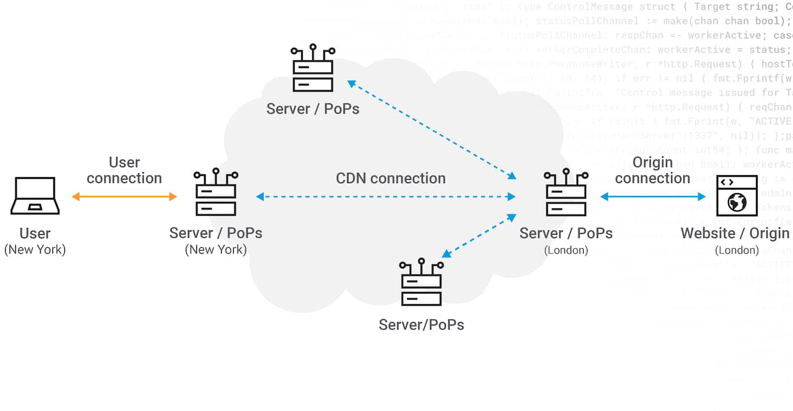

# F5 Distributed Cloud

## Credential Stuffing Attacks

Robin Mordasiewicz, a Sales Engineer at F5, will conduct a 30-minute presentation on the F5 Distributed Cloud product. The intended audience is Robert Loblaw, the IT Manager at ACME Corp.

## Background

* In a previous meeting, Robert Loblaw, the IT Manager at ACME Corp, met with Robin Mordasiewicz, a Sales Engineer from F5 who specializes in the F5 Distributed Cloud product. During this meeting, Robert, who oversees the maintenance of the ACME Corp website (https://www.acmecorp.com), informed Robin about a security audit that uncovered an ongoing credential stuffing attack on their site. This attack is causing significant revenue loss and damage to their reputation.

* Robert also shared with Robin that ACME Corp's website currently utilizes the Akamai Content Delivery Network (CDN), complemented by a subscription to the Akamai Web Application Firewall (WAF) product known as Kona. However, Robert discovered that the Akamai Kona WAF does not offer protection against credential stuffing attacks. To counter such attacks, an additional subscription to the Akamai Bot Manager product is necessary. Additionally, Robert mentioned that the Akamai CDN distributes traffic to origin servers hosted on AWS. These AWS-hosted origin servers, which serve the website's content, are also linked to an on-premises data center via DirectConnect for database access. Looking ahead, there are plans to expand the ACME Corp website's infrastructure to operate on both AWS and Azure platforms.

* Robert has invited Robin to introduce a competitive Bot Protection product from F5 Distributed Cloud, hoping it offers more comprehensive features and is more user-friendly than their current solution. He has requested Robin to showcase the Bot Protection capabilities of the F5 Distributed Cloud, along with any additional value-added features that could aid in modernizing the ACME Corp website, particularly in the area of multi-cloud networking.

* The following is the content of an F5 Distributed Cloud presentation, prepared by Robin, that focuses on credential stuffing attacks. This presentation will be delivered to Robert.

## Introduction

* Robin Mordasiewicz, a Sales Engineer at F5, is responsible for showcasing and selling F5 Distributed Cloud solutions to potential clients. One such client is Robert Loblaw, an IT Manager at ACME Corp Solutions, who oversees the maintenance of the ACME Corp website (https://www.acmecorp.com). Robin will present the following content to Robert.

## F5 Platform

F5 Distributed Cloud is one of the largest most advanced CSP, providing multi-cloud networking, high performance network DDoS, WebApp and API protections, Advanced Bot Protection, containerized workload management, over the internet or within your private networks, and connected to all the major Network as a Service providers, packet Fabric, Megaport.

Cloud providers Emphasize connectivity over security, at F5 we have a pedigree in security software.

## F5 Distributed Cloud versus Akamai

* F5 Distributed Cloud and Akamai are competitors in CDN technology as well as advanced edge security, and distributed computing. F5 Distributed Cloud has 5445 BGP peers which is more than the other cloud service providers combined, compared to Akamai which only has 1044 BGP Peers.  More BGP peers are important in shortening the path, providing multiple paths, bypassing slow or expensive transit providers, and improved performance through network health and visibility.

* F5 Distributed cloud has 31 physical data center locations located in every major region around the world, which are all colocated in Equinex Metal locations. Akamai takes a different approach, rather than leveraging BGP peers, they currently have 4,100 physical locations, otherwise known as PoPs (Points of Presence). Where F5 Distributed Cloud has taken the approach of using BGP to build the most robust cloud service provider network, Akamai's business is focused on building real estate with their massive number of PoPs.

With F5 Distributed Cloud all additional software subscriptions features such as Web App and API protections, containerized workloads distribution, intelligent DNS etc. are built natively into the platform, whereas Akamai has acquired many different products that operate independantly each with their own account management, administration interface and disconnected managemnt API's. The only exception is that the F5 Distributed Cloud Bot Defense, which provides security to protect a website from bots, fake users, and unauthorized transactions, is a service that is made available through competitors product such as AWS CloudFront, [Cloudflare](https://www.youtube.com/watch?v=eg9jke6uOLE), our BIG-IP product line, or other competitors products. F5 Distributed Cloud provides a single pane of glass UI and API management, unified RBAC across all features, and a consistent feature set across all Regional Edges.

### F5 Distributed Cloud

* 31 PoPs (Points of Presence)
* [5,445 BGP Peers](https://bgp.he.net/report/peers)
* Bot Defense

### Akamai

* 4,100 PoPs (Points of Presence)
* 1,044 BGP Peers
* Bot Manager
* Linode
* Kona
* Edge DNS
* Prolexic
* API Security
* APP & API Protector
* Acount Protector
* Cloud Firewall

## F5 Distributed Cloud Bot Defense

F5 Distributed Cloud Bot Defense is an anti automation product which uses JavaScript and API calls to collect telemetry. Both Akamai and F5 have competetive industry leading Bot Protection features including credential stuffing attack, fake account, fraud, application layer DDoS, and financial aggregator protection.

### Ease of Use

F5 Distributed Cloud Bot Defense scores higher in Gartner Peer reviews, mostly becuase of the ease of use, since all of the UI and API management is a single consolidated interface.

1. Enable Bot Defense

After logging in to the F5 Distributed Cloud console, and enabling Advanced Bot Defense, you will find the security features natively integrated into the HTTP load balancer. There is no additional portal to log into, everything is integrated into a single consolidated cloud native platform.

2. Create Bot Policy

It's a best practice to enable Bot Defense on sensitive URL's such as a login form, but you can use regex to identify patterns in sensitive URLs

3. Bot Defense Reporting

After applying the Bot Policy, launch a simulated attack using a testing tool such as Selenium, and then view the analytics in the F5 Distributed Cloud portal.

## Deployment Options

When implementing a significant change there needs to be care taken into consideration when planning out an implementation.

1. Multi-CDN Networking

2. Multi-Cloud Networking

  * The ideal service would provide a low-latency connection, with adequate throughput, to consume the storage service. This would include using services like DirectConnect for AWS, ExpressRoute for Azure, and Cloud Interconnect for GCP.

3. Branch Office/Retail

  * AppStack

## Shift Left Security

Shift Left is a practice intended to find and prevent defects early in the software delivery process. The idea is to improve quality by moving tasks to the left as early in the lifecycle as possible. Shift Left testing means testing earlier in the software development process, and this lends itself to adopting DevOps practices

###  

## References

* https://docs.cloud.f5.com/docs/how-to/advanced-security/bot-defense#connectors
