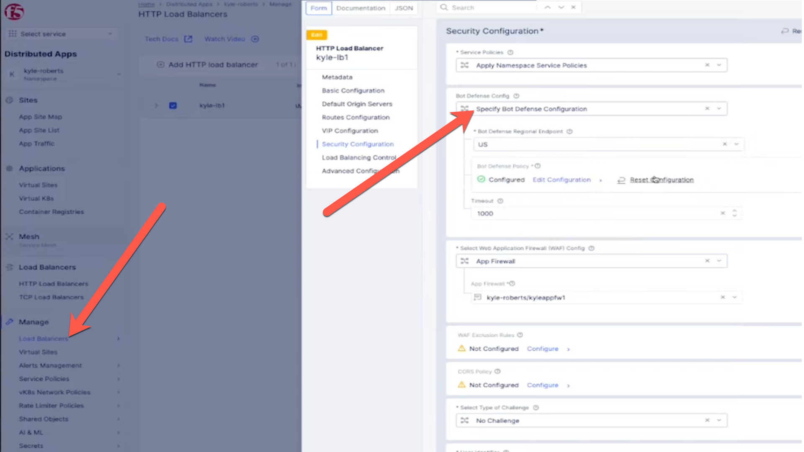

# F5 Distributed Cloud

## Credential Stuffing Attacks

This is a 30 minute presentation delivered by F5 employee Robin Mordasiewicz with job title Sales Engineer, which specializes in the F5 Distributed Cloud product. The audience is the ACME Corp employee Robert Loblaw whose job title is "IT Manager".

## Background

* In a previous meeting the ACME Corp employee named Robert Loblaw with the job title "IT Manager", met with F5 employee Robin Mordasiewicz who has a job title "Sales Engineer", and specializes in presenting and selling the F5 Distributed Cloud product. In the previous meeting Robert, who is responsible for maintaining the ACME Corp website https://www.acmecorp.com, explained to Robin that a security audit of the ACME Corp website revealed that there is currently an ongoing credential stuffing attack, which is leading to signifiant revenue loss and reputation damages.

* Robert also explained to Robin that the current architecture of the ACME Corp website is using the Akamai Content Delivery Network (CDN), with the additional subscription of the Akamai Web Application Firewall (WAF) product named Kona. Robert has learned that the Akamai Kona product does not protect against credential stuffing attacks, and that in order for Akamai to prevent credential stuffing attacks, Robert would need to purchase an additional Akamai product subscription named Akamai Bot Manager. Furthermore, Robert explained that the Akamai CDN load balances to origin servers that are hosted in AWS, and the origin servers that are in AWS which are hosting the website content are also connected to an on premisis datacenter using DirectConnect for database access, and that future plans to be considered are that the ACME Corp website will also expand to be running in both AWS and Azure.

* Robert has invited Robin to present a competetive Bot Protection product from F5 Distributed Cloud in the hopes that the F5 Distributed Cloud product is more fully featured and easier to use. Robert asked Robin to present the F5 Distributed Cloud Bot Protection functionality as well as the additional value add features that the F5 Distributed Cloud product can help with modernizing the ACME Corp website, specifically around multi-cloud networking.

* What follows is the content for an F5 Distributed Cloud presentation focusing on credential stuffing attacks, that Robin will present to Robert.

## Introduction

Robin Mordasiewicz employee of F5 is a Sales Engineer responsible for presenting and selling F5 Distributed Cloud solutions to potential customer Robert Loblaw, employee of ACME Corp Solutions who is a IT Manager and responsible for maintaining the ACME Corp website https://www.acmecorp.com. Robin will present the following content to Robert.

## F5 Platform

F5 Distributed Cloud is one of the largest most advanced CSP, providing multi-cloud networking, high performance network DDoS, WebApp and API protections, Advanced Bot Protection, containerized workload management, over the internet or within your private networks, and connected to all the major Network as a Service providers, packet Fabric, Megaport.

Cloud providers Emphasize connectivity over security, at F5 we have a pedigree in security software.

## F5 Distributed Cloud versus Akamai

F5 Distributed Cloud and Akamai are competitors in CDN technology as well as advanced edge security, and distributed computing. F5 Distributed Cloud is ostenisbly one of the largest service providers on the planet with more BGP peers (5,445) than the other cloud service providers combined. More BGP peers are important in shortening the path, providing multiple paths, bypassing slow or expensive transit providers, and improved performance through network health and visibility. F5 Distributed cloud has 31 PoPs which are located in every major region around the world, which are all colocated in Equinex Metal locations. Akamai takes a different approach, rather than leveraging BGP peers, they have built 4,100 PoPs (Points of Presence). Where F5 Distributed Cloud has taken the approach of using BGP to build the most robust cloud service provider network, Akamai's business is focused on building real estate.

With F5 Distributed Cloud all additional software subscriptions features such as Web App and API protections, containerized workloads distribution, intelligent DNS etc. are built natively into the platform, whereas Akamai has acquired many different products that operate independantly each with their own account management, administration interface and disconnected managemnt API's. The only exception is that the F5 Distributed Cloud Bot Defense, which provides security to protect a website from bots, fake users, and unauthorized transactions, is a service that is made available through competitors product such as AWS CloudFront, [Cloudflare](https://www.youtube.com/watch?v=eg9jke6uOLE), our BIG-IP product line, or other competitors products. F5 Distributed Cloud provides a single pane of glass UI and API management, unified RBAC across all features, and a consistent feature set across all Regional Edges.

### F5 Distributed Cloud

* 31 PoPs (Points of Presence)
* [5,445 BGP Peers](https://bgp.he.net/report/peers)
* Bot Defense

### Akamai

* 4,100 PoPs (Points of Presence)
* 1,044 BGP Peers
* Bot Manager
* Linode
* Kona
* Edge DNS
* Prolexic
* API Security
* APP & API Protector
* Acount Protector
* Cloud Firewall

## F5 Distributed Cloud Bot Defense

F5 Distributed Cloud Bot Defense is an anti automation product which uses JavaScript and API calls to collect telemetry. Both Akamai and F5 have competetive industry leading Bot Protection features including credential stuffing attack, fake account, fraud, application layer DDoS, and financial aggregator protection.

### Ease of Use

F5 Distributed Cloud Bot Defense scores higher in Gartner Peer reviews, mostly becuase of the ease of use, since all of the UI and API management is a single consolidated interface.

1. Enable Bot Defense

After logging in to the F5 Distributed Cloud console, and enabling Advanced Bot Defense, you will find the security features natively integrated into the HTTP load balancer. There is no additional portal to log into, everything is integrated into a single consolidated cloud native platform.

2. Create Bot Policy

It's a best practice to enable Bot Defense on sensitive URL's such as a login form, but you can use regex to identify patterns in sensitive URLs

3. Bot Defense Reporting

After applying the Bot Policy, launch a simulated attack using a testing tool such as Selenium, and then view the analytics in the F5 Distributed Cloud portal.

## Deployment Options

When implementing a significant change there needs to be care taken into consideration when planning out an implementation.

1. Multi-CDN Networking

2. Multi-Cloud Networking

* The ideal service would provide a low-latency connection, with adequate throughput, to consume the storage service. This would include using services like DirectConnect for AWS, ExpressRoute for Azure, and Cloud Interconnect for GCP.

3. Branch Office/Retail

  * AppStack

## Shift Left Security

Shift Left is a practice intended to find and prevent defects early in the software delivery process. The idea is to improve quality by moving tasks to the left as early in the lifecycle as possible. Shift Left testing means testing earlier in the software development process, and this lends itself to adopting DevOps practices

###  

F5 Bot Defense
 - deploy VIP
 - configure policy
MCN
Private link
  -
AppAstack - branch/retail

Multi-CDN
Terraform
CICD

* https://docs.cloud.f5.com/docs/how-to/advanced-security/bot-defense#connectors
