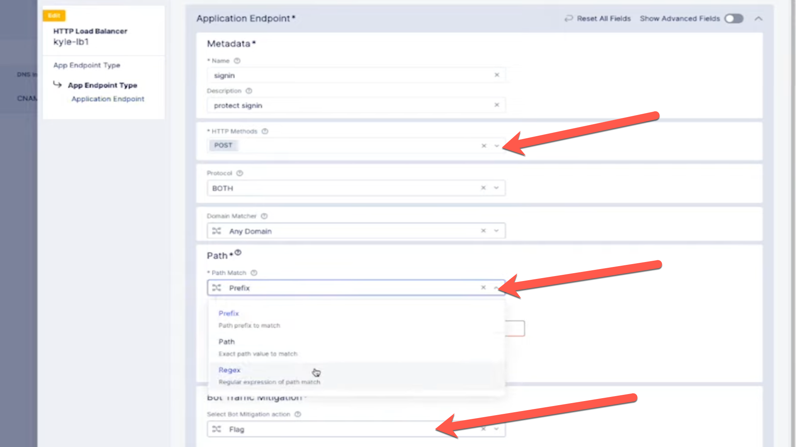

# Fortinet Cloud Solutions

## Credential Stuffing Attacks

Robin Mordasiewicz, a Sales Engineer at Fortinet, will conduct a 30-minute presentation on the Fortinet Cloud Solutions products. The intended audience is Robert Loblaw, the IT Manager at ACME Corp.

## Background

* In a previous meeting, Robert Loblaw, the IT Manager at ACME Corp, met with Robin Mordasiewicz, a Sales Engineer from Fortinet who specializes in the Fortinet Cloud Solutions products. During this meeting, Robert, who oversees the maintenance of the ACME Corp website (https://www.acmecorp.com), informed Robin about a security audit that uncovered an ongoing credential stuffing attack on their site. This attack is causing significant revenue loss and damage to their reputation.

* Robert also shared with Robin that ACME Corp's website currently utilizes the Akamai Content Delivery Network (CDN), complemented by a subscription to the Akamai Web Application Firewall (WAF) product known as Kona. However, Robert discovered that the Akamai Kona WAF does not offer protection against credential stuffing attacks. To counter such attacks, an additional subscription to the Akamai Bot Manager product is necessary. Additionally, Robert mentioned that the Akamai CDN distributes traffic to origin servers hosted on AWS. These AWS-hosted origin servers, which serve the website's content, are also linked to an on-premises data center via DirectConnect for database access. Looking ahead, there are plans to expand the ACME Corp website's infrastructure to operate on both AWS and Azure platforms.

* Robert has invited Robin to introduce a competitive Bot Protection product from Fortinet Cloud Solutions, hoping it offers more comprehensive features and is more user-friendly than their current solution. He has requested Robin to showcase the Bot Protection capabilities of the Fortinet Cloud Solutions, along with any additional value-added features that could aid in modernizing the ACME Corp website, particularly in the area of Multi-Cloud Networking, kubernetes containerized workloads, devops, and shift-left security.

* The following is the content of an Fortinet Cloud Solutions presentation, prepared by Robin, that focuses on credential stuffing attacks. This presentation will be delivered to Robert.

## Introduction

* Robin Mordasiewicz, a Sales Engineer at Fortinet, is responsible for showcasing and selling Fortinet Cloud Solutions solutions to potential clients. One such client is Robert Loblaw, an IT Manager at ACME Corp Solutions, who oversees the maintenance of the ACME Corp website (https://www.acmecorp.com). Robin will present the following content to Robert.

## Fortinet Platform Overview

* The Fortinet Cloud Solutions are a suite of products that provides [Multi-Cloud Networking], high performance network DDoS, WebApp and API protections, Advanced Bot Protection, containerized workload management, and is able to connect to all the major Network as a Service providers, packet Fabric, Megaport. Fortinet Cloud Solutions is also able to provide the same features and functionality not only to internet facing clients, but can also connect to internal only networks, while participating with internal BGP routers so that the same load-balancing that is available externally, can also be configured on internal corporate networks that are interconnected with a Network as a Service provider such as megaport or packetfabric. Furthermore, the Fortinet Cloud Solutions software stack can be deployed directly into private workload locations such as an Amazon VPC (AWS VPC), or within an on-premis private data center which may also eliminate the need for locally managed load balancers, or firewalls. The FortiOS version of Fortinet Cloud Solutions can be deployed as a virtual machine, or onto bare metal.

## Fortinet versus Palo Alto

### Fortinet Cloud Solutions

* FortiOS
*
* Bot Defense

### Palo Alto

* 4,100 PoPs (Points of Presence)
* 1,044 BGP Peers
* Bot Manager
* Linode
* Kona
* Edge DNS
* Prolexic
* API Security
* APP & API Protector
* Acount Protector
* Cloud Firewall

### Ease of Use

* Fortinet Cloud Solutions Bot Defense scores higher in Gartner Peer reviews, mostly because of the ease of use, since all of the UI and API management is a single consolidated interface.

## [Fortinet Cloud Solutions Bot Defense](https://www.youtube.com/watch?v=qofQozTpqo4)

* Fortinet Cloud Solutions Bot Defense is an anti-automation solution that employs JavaScript and API calls for telemetry collection. Both Akamai and Fortinet offer leading bot protection features, including defenses against credential stuffing, fake accounts, fraud, application layer DDoS, and financial aggregator threats.

* Commonly used mitigations to combat credential stuffing, including CAPTCHA and multi-factor authentication (MFA), are easily bypassed by sophisticated attackers and can frustrate real customers, leading to abandoned transactions and lost revenue. Additionally, credential stuffing attacks are often an early indicator that there will be other more sophisticated attacks launched.

1. Enable Bot Defense

* After logging into the Fortinet Cloud Solutions console and enabling Advanced Bot Defense, you'll find the security features integrated within the HTTP load balancer, eliminating the need for an additional portal and offering a unified, cloud-native platform experience.

2. Create Bot Policy

* Create an App endpoint

* Specify the method to POST on both protocol on any domains, and for Path matching we can do prefix, regex or exact path, and for the actions you want to change it from Flag to Block.

* So you can do things like enable carding against a payment page and credential stuffing against other pages.

* From there we can specify how we want to inject the Javascript, which usually after the HEAD tag, but it can be in a script or after the title tag.

* It's best practice to activate Bot Defense on sensitive URLs, like login forms, using regex to detect patterns in these URLs.

3. Bot Defense Reporting

* After applying the Bot Policy, launch a simulated attack using a testing tool such as Selenium, and then view the analytics in the Fortinet Cloud Solutions portal.

## Deployment Options

* Currently the ACME Corp website is using Akamai, which then load-balances to origin servers that are running in a VPC. The origin servers that are located in AWS are connected with a low-latency DirectConnect, to consume the database services running on prem.

* When implementing a significant change there needs to be care taken into consideration when planning out an implementation. Currently the ACME Corp website has a static DNS record which resolves to an Akamai anycast IP address. The challenge is, "How is it possible to introduce Fortinet Cloud Solutions without making any disruptive changes that might cause downtime".

1. Multi-CDN

* To seamlessly integrate an additional A record, an intelligent DNS service with Global Server Load Balancing (GSLB) is essential. This approach allows the ACME Corp website to utilize multiple CDN services by incorporating GSLB into its DNS. GSLB can be configured for various strategies such as active-standby, geographic-based resolution, or health check-based decisions to manage issues with a primary CDN. Implementing GSLB for ACME Corp's DNS resolution enables the concurrent use of both Akamai and Fortinet Cloud Solutions CDNs.

2. Regional Edge Campus Area Private Network

* A distinctive feature of the Fortinet Cloud Solutions platform, not offered by Akamai, is its ability to advertise services on the same private Network As a Service providers through the Fortinet Cloud Solutions Regional Edges. This enables the Fortinet Cloud Solutions's IP anycast services, accessible on the internet, to be identical to those advertised on internal, campus-type networks.

3. FortiOS in Virtual Private Cloud

* The Fortinet Cloud Solutions software, operational in Equinix Regional Edge locations, can be deployed as a virtual machine into your VPCs, removing the necessity for intricate transit gateways and costly, complex firewall virtual machines. FortiOS instances establish redundant encrypted tunnels with Fortinet Cloud Solutions Regional Edges, eliminating the need for VPCs to expose public IP addresses for NATting to origin servers.

* IP Overlap is often a challenge: With Fortinet Cloud Solutions FortiOS proxies, we can service all the Masqueriding and NAT requirements.

4. FortiOS and Kubernetes

* An Fortinet Cloud Solutions instance can be deployed as a managed Kubernetes platform on both virtual machines and bare metal. FortiOS-managed Kubernetes can utilize high-performance GPUs in public clouds or on-premises hardware in remote or retail locations. This enables computationally intensive containerized workloads to leverage GPUs, supporting the increasing trend of organizations deploying GPUs for private AI services running open-source Large Language Models (LLMs).

## Shift Left Security

* Shift Left is a strategy aimed at identifying and mitigating defects early in the software delivery cycle by shifting tasks earlier in the lifecycle to enhance quality. This approach encourages early testing and supports the adoption of DevOps practices.

### GitOps SDLC

* A GitOps workflow with shift-left security automates security integration early in the development lifecycle by treating infrastructure and app configurations as code in Git. This approach facilitates collaboration among developers by enabling the creation of multiple namespaces, often used for departmental resource separation or throughout the development process. For instance, when a developer initiates a new feature branch in Git, automation can generate a corresponding namespace. This allows CI/CD testing to occur within this development namespace. Upon pull request approval, the automation will remove both the Git development branch and its associated namespace in Fortinet Cloud Solutions.

### Infrastructure as Code

* The Fortinet Cloud Solutions platform supports automation via the REST API with RBAC-enforced token authentication, allowing for integration into existing CI/CD pipelines. Official Fortinet GitHub repositories provide Terraform examples for infrastructure as code.

## References
